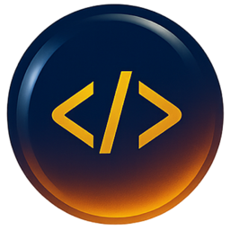

<p align="center">
  <a href="https://tandemcode.space">
    
  </a>
</p>

<h1 align="center">TandemCode</h1>

<p align="center">
  <strong>Practice coding problems with a partner.</strong><br>
  One shared editor, one judge, and a replay of the whole session.
</p>

<p align="center">
  <a href="https://tandemcode.space"><strong>tandemcode.space</strong></a>
  &nbsp;&middot;&nbsp;
  <a href="docs/README.md">Docs</a>
  &nbsp;&middot;&nbsp;
  <a href="CONTRIBUTING.md">Add a problem</a>
</p>

<p align="center">
  <a href="https://tandemcode.space"></a>
  <a href="https://api.tandemcode.space/health"></a>
  <a href="https://github.com/naman0r/tandemcode/deployments"></a>
  <a href="https://github.com/naman0r/tandemcode/actions/workflows/backend-tests.yml"></a>
  <a href="https://github.com/naman0r/tandemcode/actions/workflows/web-checks.yml"></a>
  <a href="LICENSE"></a>
</p>

Two people share a room, edit the same code with live cursors, chat, and run their solution against the problem's tests together. Everyone in the room sees the verdict, and the session can be replayed afterwards. TandemCode is free and open source under the Apache License 2.0.

## What it does

- Rooms that are public or unlisted, shared by invite link, with a way to ask for a partner.
- One shared editor with live cursors, built on Yjs.
- Problems with starter code, visible examples and hidden tests, added by pull request.
- Python submissions judged in an isolated container per run, with the verdict shown to everyone in the room.
- A replay of each session: the code as it was typed, the chat and every run.

## Run it locally

You need Docker, Node 22 and a free Clerk application.

```bash
make setup    # copy the .env templates, install web dependencies
              # then fill in the Clerk keys and a DB password
make up       # Postgres, the API and the runner
make web      # http://localhost:5173
```

[docs/development.md](docs/development.md) has the details, the checks and the common changes.

## Stack

- Web: React 19, Vite, TypeScript, Tailwind, Monaco, Yjs, Clerk.
- API: FastAPI on Python 3.11 with asyncpg, HTTP plus two websockets.
- Runner: the API's image running `python -m app.runner`, judging in Docker containers under gVisor.
- Database: Postgres 17 with forward-only SQL migrations.
- Production: one Linux host with Docker Compose and Caddy, and the web app on Vercel.

## Docs

- [Development](docs/development.md)
- [Architecture](docs/architecture.md)
- [Judge and sandbox](docs/judge-and-sandbox.md)
- [Self-hosting](docs/self-hosting.md)
- [Decisions](docs/decisions/)

## Contributing

Pull requests are welcome, and adding a problem is the easiest place to start. [CONTRIBUTING.md](CONTRIBUTING.md) explains both. Report security issues privately as described in [SECURITY.md](SECURITY.md).
